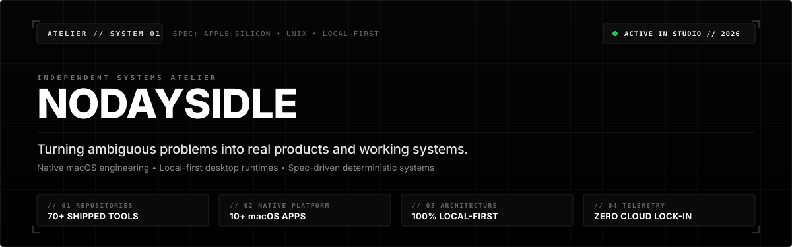
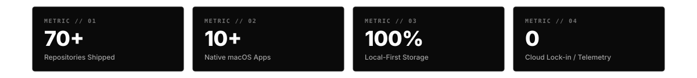

<!--
  DO NOT EDIT README.md DIRECTLY!
  This file is automatically generated from /data/profile.json and /templates/README.template.md.
  To make changes:
    1. Update data/profile.json
    2. Run: npm run build (or node scripts/generate.js)
    3. Commit data/profile.json and README.md
-->

<div align="center">

<picture>
  <source media="(prefers-color-scheme: dark)" srcset="./assets/hero-dark.svg">
  <source media="(prefers-color-scheme: light)" srcset="./assets/hero-light.svg">
  
</picture>

<br/><br/>

<p align="center">
  <a href="#01--the-atelier"></a> &nbsp;
  <a href="#02--operating-principles"></a> &nbsp;
  <a href="#03--flagship-systems"></a> &nbsp;
  <a href="#04--architectural-stack--domains"></a> &nbsp;
  <a href="#05--studio-telemetry"></a> &nbsp;
  <a href="#06--direct-reach"></a>
</p>

</div>

---

## 01 // THE ATELIER

### A craft-driven engineering practice rooted in native performance and local-first architecture.

I design, architect, and ship production-grade software across macOS native environments, high-performance desktop runtimes, and resilient web services. I avoid disposable prototypes and roadmap hype: every project in the catalogue has one clear job, a reproducible build, and working code that runs directly on hardware.

My work focuses on transforming unstructured, ambiguous goals into deterministic software. From low-latency audio processing and on-device Core ML to custom desktop tools and spec-driven code synthesis, I build with high agency, deep respect for platform conventions, and strict privacy by default.

> ⚙️ **Operational Thesis:** Software should respect the machine it executes on and the operator directing it. Native runtimes, local storage by default, zero telemetry, and rigorous deterministic execution.

---

## 02 // OPERATING PRINCIPLES

<table width="100%">
  <tr>
    <td width="50%" valign="top">
      <code>// 01</code> <b>Ship Real Products</b><br/>
      <sub>Finished tools over slide decks. If an application exists in the catalogue, it compiles cleanly, passes tests, and installs without a debug session.</sub>
    </td>
    <td width="50%" valign="top">
      <code>// 02</code> <b>Native First</b><br/>
      <sub>Build for the platform, not against it. Swift 6, AppKit, Metal, and Rust over heavy wrappers to guarantee instant responsiveness and zero memory bloat.</sub>
    </td>
  </tr>
  <tr>
    <td width="50%" valign="top">
      <code>// 03</code> <b>Local-First by Default</b><br/>
      <sub>User data lives on-device in local SQLite or filesystem storage. Cloud integrations are explicit opt-in enhancements, never architectural lock-in.</sub>
    </td>
    <td width="50%" valign="top">
      <code>// 04</code> <b>Deterministic Quality</b><br/>
      <sub>Spec-driven architectures, strict typing, and end-to-end automated validation ensure systems behave predictably across every execution.</sub>
    </td>
  </tr>
</table>

---

## 03 // FLAGSHIP SYSTEMS

### // 01 • ★ [NODAYSIDLE Cascade v3](https://github.com/nodaysidle/nodaysidle-cascade-v3)
> **Deterministic AI architecture engine turning one idea into five verified markdown contracts**
> 
> [](https://github.com/nodaysidle/nodaysidle-cascade-v3) [](https://github.com/nodaysidle/nodaysidle-cascade-v3) [](https://github.com/nodaysidle/nodaysidle-cascade-v3)

Spec-driven AI engineering platform that converts ambiguous product ideas into five immutable, agent-ready markdown contracts (PRD, ARD, TRD, TASKS, AGENTS). Features TypeSafe Jev viability preflights, Rust HTTPS provider boundaries, AST validation, and atomic exact-five exports across Native macOS, Tauri 2, Astro Web, and Android Compose presets.

**Architecture & Systems Spec:**
  - ✦ Turns 1 product concept into 5 verified agent-ready contracts (PRD/ARD/TRD/TASKS/AGENTS)
  - ✦ TypeSafe Jev viability preflight & platform-fit healing gates
  - ✦ Deterministic local normalization & atomic exact-five export with SHA-256 validation

**Stack:** `Rust` • `Tauri 2` • `TypeScript` • `DeepSeek` • `Jev Systems` • `Spec-Driven`

[**Inspect Source Repository →**](https://github.com/nodaysidle/nodaysidle-cascade-v3) &nbsp;|&nbsp; [**Download Release Artifacts →**](https://github.com/nodaysidle/nodaysidle-cascade-v3)

---

### // 02 • [Synapse Notes](https://github.com/nodaysidle/synapse-notes)
> **Voice-to-knowledge pipeline with AI transcription, FLUX visuals & 3D Obsidian-like orbs**
> 
> [](https://github.com/nodaysidle/synapse-notes) [](https://github.com/nodaysidle/synapse-notes)

Voice-first capture system with a continuous multimodal synthesis pipeline: tap the mic to record, get verbatim transcription via OpenRouter Whisper Large V3 Turbo, automatically synthesize a contextual note illustration via Replicate FLUX Schnell stored in your gallery, and navigate linked notes in an interactive 3D force-directed knowledge graph with pgvector semantic search.

**Architecture & Systems Spec:**
  - ✦ Continuous voice recording to verbatim AI note transcription pipeline
  - ✦ Automated FLUX Schnell visual synthesis saved directly into note gallery
  - ✦ Force-directed 3D knowledge graph (Three.js) + pgvector 768-dim semantic search

**Stack:** `Voice-First` • `Three.js` • `Whisper V3` • `FLUX Schnell` • `pgvector` • `Capacitor`

[**Inspect Source Repository →**](https://github.com/nodaysidle/synapse-notes) &nbsp;|&nbsp; [**Download Release Artifacts →**](https://github.com/nodaysidle/synapse-notes)

---

### // 03 • [NODAYSIDLE Browser](https://github.com/nodaysidle/nodaysidle-browser)
> **Surgical, telemetry-free native macOS browser built on Swift 6 and WebKit**
> 
> [](https://github.com/nodaysidle/nodaysidle-browser) [](https://github.com/nodaysidle/nodaysidle-browser)

Focused native macOS browser engineered with zero Electron overhead, zero trackers, and zero background analytics. Features a single @Observable @MainActor state store, native tabs with ⌘K tab palette, local session persistence, and an encrypted CryptoKit vault for private bookmark and history syncing.

**Architecture & Systems Spec:**
  - ✦ 100% native Swift 6 and WebKit architecture with zero Electron footprint
  - ✦ Local-first persistence with encrypted CryptoKit sync vault
  - ✦ Zero analytics, telemetry, or application-owned browsing backend

**Stack:** `Swift 6` • `SwiftUI` • `WebKit` • `CryptoKit` • `macOS 14+` • `Local-First`

[**Inspect Source Repository →**](https://github.com/nodaysidle/nodaysidle-browser) &nbsp;|&nbsp; [**Download Release Artifacts →**](https://github.com/nodaysidle/nodaysidle-browser)

---

### // 04 • [NODAYSIDLE Sonora](https://github.com/nodaysidle/nodaysidle-sonora)
> **Native desktop audio player replacing bloated Electron streaming apps**
> 
> [](https://github.com/nodaysidle/nodaysidle-sonora) [](https://github.com/nodaysidle/nodaysidle-sonora/releases/tag/v0.1.1)

Rethinks the desktop music player from the bare metal up to replace bloated Chromium shells. Unites Spotify, YouTube Music, and local FLAC audio into a single canvas with sample-accurate gapless playback, hardware EBU R128 loudness normalization, instant Asian lyric romanization, and <105 MB idle RAM consumption.

**Architecture & Systems Spec:**
  - ✦ Solves bloated Electron memory consumption: <105 MB RAM idle vs 1.2 GB
  - ✦ Hardware EBU R128 loudness normalization (-14 LUFS real-time gain stage)
  - ✦ Unified canvas uniting local FLACs, Spotify playlists, and YouTube Music streams

**Stack:** `Rust` • `Tauri 2` • `React 19` • `Audio Engine` • `Spotify` • `Zero-Electron`

[**Inspect Source Repository →**](https://github.com/nodaysidle/nodaysidle-sonora) &nbsp;|&nbsp; [**Download Release Artifacts →**](https://github.com/nodaysidle/nodaysidle-sonora/releases/tag/v0.1.1)

---

### // 05 • [WhisperBar](https://github.com/nodaysidle/whisper-bar)
> **Native macOS menu bar dictation with sub-150ms structured inference**
> 
> [](https://github.com/nodaysidle/whisper-bar) [](https://github.com/nodaysidle/whisper-bar)

Lightweight, high-performance macOS menu-bar utility delivering instantaneous AI voice dictation to any application on your Mac. Features TypeSafe Jev System One sub-150ms inference gates, Deepgram Nova-3 live audio streaming, SuperWhisper 288-term deterministic vocabulary replacement, and hardware Keychain credential storage with zero disk audio leakage.

**Architecture & Systems Spec:**
  - ✦ Sub-150ms TypeSafe Jev System One decision engine with smart refinement gate
  - ✦ 288-term SuperWhisper technical vocabulary replacement engine
  - ✦ Zero third-party dependencies, strict Keychain credential isolation

**Stack:** `Swift 6` • `Deepgram Nova-3` • `TypeSafe Jev` • `Keychain` • `macOS Menu Bar`

[**Inspect Source Repository →**](https://github.com/nodaysidle/whisper-bar) &nbsp;|&nbsp; [**Download Release Artifacts →**](https://github.com/nodaysidle/whisper-bar)


---

## 04 // ARCHITECTURAL STACK & DOMAINS

#### MACOS & NATIVE SYSTEMS

      

#### SYSTEMS & DESKTOP ENGINES

    

#### MODERN WEB & DISTRIBUTED BACKENDS

       

#### AUDIO, ML & SIGNAL INTELLIGENCE

    

---

## 05 // STUDIO TELEMETRY

<div align="center">

<picture>
  <source media="(prefers-color-scheme: dark)" srcset="./assets/stats-card-dark.svg">
  <source media="(prefers-color-scheme: light)" srcset="./assets/stats-card-light.svg">
  
</picture>

</div>

---

## 06 // DETERMINISTIC PIPELINE

This landing surface compiles from structured JSON via an automated headless pipeline:

- **Single Source of Truth**: Profile specs, product catalogue, stack, and telemetry are maintained in [`data/profile.json`](./data/profile.json).
- **Aerospace Graphics Engine**: Responsive SVG telemetry banners generated by [`scripts/generate-graphics.js`](./scripts/generate-graphics.js).
- **Daily Automated Synchronization**: Triggered at `04:00 UTC` daily via GitHub Actions ([`.github/workflows/daily-refresh.yml`](./.github/workflows/daily-refresh.yml)).
- **Zero Third-Party Dependencies**: Runs strictly on standard native Node.js runtimes.

```bash
# Compile locally
npm run build
```

<div align="right">
<sub><i>Automated Studio Build: <code>2026-09-28 18:07 UTC</code> • Engine: <code>scripts/generate.js</code></i></sub>
</div>

---

## 07 // DIRECT REACH

<div align="center">

[](https://github.com/nodaysidle) [](mailto:nodaysidle@tutanota.de) [](https://github.com/nodaysidle)

<br/><br/>

<code>nodaysidle@tutanota.de</code> • <code>Ljubljana / CET • Apple Silicon & Unix</code> • <code>OpenPGP Available on Request</code>

</div>
